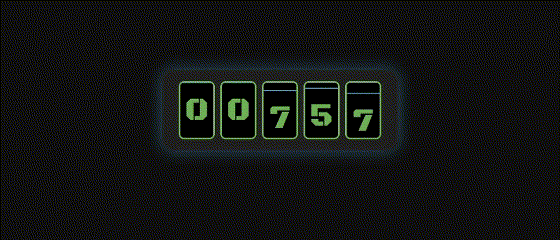

# ⛽ Contador Retrô Mecânico

Um contador animado inspirado nos antigos mostradores de bomba de gasolina, com dígitos girando verticalmente como tambores mecânicos. Projeto construído com HTML, CSS e JavaScript puros.

 <!-- Substitua por uma imagem ou GIF se quiser -->

## ✨ Demonstração

Cada dígito gira verticalmente em uma animação suave, simulando a rotação de tambores numéricos mecânicos. Ideal para exibir:

- Contagem de tempo
- Valor monetário
- Leituras analógicas simuladas
- Elementos estéticos retrô

---

## 🧱 Tecnologias utilizadas

- **HTML5** – Estrutura do projeto
- **CSS3** – Estilização temática retrô
- **JavaScript Vanilla** – Lógica de contagem e animação
- **Google Fonts** – Tipografia especial: `Black Ops One`

---

## 🖼️ Visual retrô

O design foi inspirado em:

- Mostradores mecânicos antigos
- Cores vintages (verde #6BA552 e azul #4695C6)
- Sensação analógica e charmosa dos contadores de décadas passadas

---

## 📁 Estrutura dos arquivos

# counter_retro
